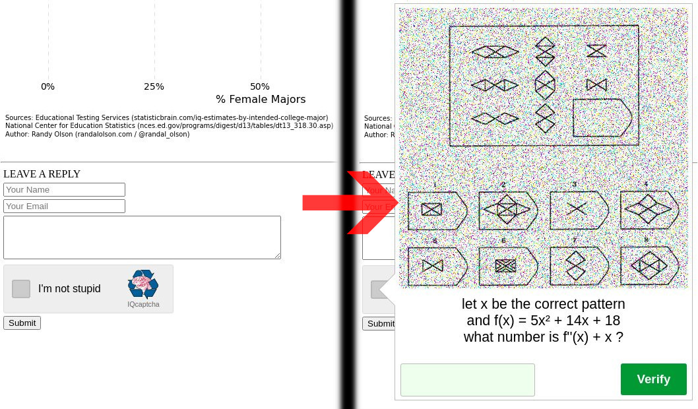

<h1 align="center">
  <a href="http://iqcaptcha.us.to/">
    
  </a>
</h1>

<p align=center>
  <strong><a href="http://iqcaptcha.us.to/">Website</a></strong>
  | <strong><a href="http://iqcaptcha.us.to/repo/demo/demo.html">Demo</a></strong>
  | <strong><a href="http://iqcaptcha.us.to/forum">Forum</a></strong>
</p>

<p align="center">
IQcaptcha tests against IQ with Raven's progressive matrices and high school calculus. It is written to be fairly compatible with Google's reCAPTCHA v2, so that already existing plugins and implementations of reCAPTCHA can easily be switched to IQcaptcha.
</p>

[](#)
<p>&nbsp;</p>
<p align="center">
    
  </a>
</p>
<p>&nbsp;</p>


Installation
----------------------------------------------------------------
Put files onto webserver.

Run composer install.


Principle of Operation
----------------------------------------------------------------
To validate on the client side, api.js queries verify.php via XHR. Verify.php creates a PHP session and stores the state of verification in it. To validate on the backend, the server has to query verify.php with the session ID via http request. 

Although IQcaptcha accepts public and secret API keys, those **API keys are not required** and only named such for compatibility reasons. Instead they can be used as a site/application specific token (e.g. test.com-myforum-VZCck432random5jk372). If you switch a reCAPTCHA plugin to IQcaptcha, make sure that public key and secret key are identical.

Verify.php will only validate whether or not the client sitekey matches the backend parameter "sitekey" if provided, and if the session is valid. Please check from your backend if all the data-... parameters (wrongmax, sitekey, userid, etc.) you provided do actually match your client-side provided parameters.

Anyone is free to create arbitrary sessions with arbitrary parameters and also to read any sessions if the session key is known. This is not a potential security issue, no sensitive data is stored. But it does allow attackers to create a surplus of requests, until IP-based limits are reached. 

To solve this problem, you can provide "userid" (not implemented yet!). If provided, only as many requests can be made per userid as specified.

Client Side Usage
----------------------------------------------------------------
1. Load the script in the head:
```
<script src='http://iqcaptcha.us.to/repo/api.js' async defer></script> 
<!--- please use your own URL not iqcaptcha.us.to --->
```

2. Putting this tag into your form:
```
<div class="iq-captcha-element"></div>
```
Any of the following classes can be used: iq-captcha-element, g-iqcaptcha, g-recaptcha.

You can also use what is known with reCAPTCHA as [explicit rendering](https://developers.google.com/recaptcha/docs/display). This is not completely implemented.


If you want to specify different limits and parameters, refer to the keys at the end of "Backend Usage" and prefix them with "data-" as new div tags. 

<details>
  <summary>Example</summary>
  
   ```
   <div class="iq-captcha-element" data-sitekey="mytest.com-guestbook-asklfhsrandomdjfskfh" data-wrongmax="5" data-wrongtimeout="999"></div>
   ```
</details>

Backend Usage
----------------------------------------------------------------

Any of the following form fields will contain the correct client session id: iq-captcha-session, g-recaptcha-response, g-iqcaptcha-response .

Call verify.php via either GET or POST.
```
http://iqcaptcha.us.to/repo/verify.php?session=[the session id]&sitekey=[the sitekey is optional]   
/* please use your own URL not iqcaptcha.us.to */
```
For reCAPTCHA recompatibility, you can also use "response" and "secret" instead of "session" and "sitekey".

The return data will be in JSON:
```
{
  "success": true|false,
  "stock_parameters": true|false,        // this will be true, if none of the limits (timeouts, max tries, etc.) were changed
  "create_time":  timestamp,             // unix timestamp when the session was created
  "challenge_ts": timestamp,             // Human readable timestamp
  "hostname": string,                    // whatever the client specified (currently unused)

  // these keys can also be specified by the client
  "wrongmax": int(3-10),                 // how often the client can fail the challenge
  "wrongtimeout": int(180-60000),        // how long client will be timed out in seconds, after failing wrongmax times
  "maxtime": int(180-43440),             // how long the session will be valid in seconds (between 3 minutes to 7 days)
  "sitekey": string,                     // the sitekey / secret used by the client
}
```

Please check in your backend if all parameters you used do actually match the response. Otherwise the client can potentially make a whole lot more attempts to create a valid sessions than what can be reasonably avoided.

<details>
  <summary>Backend Code Example</summary>


This code is part of [the demo](demo/). Live demo: [here](http://iqcaptcha.us.to/repo/demo/demo.html).

```
<?php
$mywrongmax = 6;
$mywrongtimeout = 360;
$mysitekey = "b35074286103ba87e759d081640433b4";

$data = [ 'session' => $_GET['iq-captcha-session'], // this would be _POST in most cases
          'sitekey' => $mysitekey,
        ];

$response = json_decode(iqcaptcha_verify($data), true);

if($response['success'] && $response['sitekey'] == $mysitekey && $response['wrongmax'] == $mywrongmax && $response['wrongtimeout'] == $mywrongtimeout)
{
    echo "verified";
    // grant access
}
else echo "not verified!";

function iqcaptcha_verify($data)
{
    // assemble URL relative to calling script
    $url = filter_input(INPUT_SERVER, "REQUEST_SCHEME")."://" 
			. (strlen(filter_input(INPUT_SERVER, 'PHP_AUTH_USER')) > 0 
				? filter_input(INPUT_SERVER, 'PHP_AUTH_USER') . ":" . filter_input(INPUT_SERVER, 'PHP_AUTH_PW') . "@"
				: "")
			. filter_input(INPUT_SERVER, 'HTTP_HOST')
			. ":" .  filter_input(INPUT_SERVER, "SERVER_PORT")
		        . "/" . substr(__DIR__, strlen(filter_input(INPUT_SERVER, 'DOCUMENT_ROOT'))) 
		        . "/../verify.php";
        
    $options = array(
            'http' => array(
                'header' => "Content-type: application/x-www-form-urlencoded\r\n",
                'method' => 'POST',
                'content' => http_build_query($data, '', '&'),
            ),
         );
    $context = stream_context_create($options);
    $response = file_get_contents($url, false, $context);
    // please use your own url not iqcaptcha.us.to

    if ($response !== false) {
       return $response;
    }

    return '{"success": false }';
}

```

</details>

## License

 Copyright (C) 01.04.2021 Ballerburg9005

This program is free software: you can redistribute it and/or modify
it under the terms of the GNU General Public License as published by
the Free Software Foundation, either version 3 of the License, or
(at your option) any later version.

This program is distributed in the hope that it will be useful,
but WITHOUT ANY WARRANTY; without even the implied warranty of
MERCHANTABILITY or FITNESS FOR A PARTICULAR PURPOSE.  See the
GNU General Public License for more details.

You should have received a copy of the GNU General Public License
along with this program.  If not, see <https://www.gnu.org/licenses/>.
